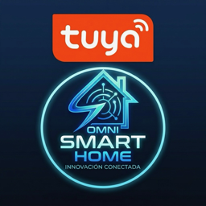

<p align="center">
  
</p>

<h1 align="center">Omni Tuya Local</h1>
<p align="center">
  Integración HACS para control <strong>local</strong> de dispositivos Tuya en Home Assistant.<br/>
  Sin nube para el control. Sin latencia. Sin dependencias externas en runtime.
</p>

<p align="center">
  
  
  
  
</p>

---

## ¿Qué hace?

**Omni Tuya Local** es una integración nativa de Home Assistant que controla tus dispositivos Tuya **directamente en tu red local**, usando el protocolo propietario de Tuya (vía `tinytuya`).

La nube de Tuya se usa **únicamente** para importar la ficha completa del dispositivo: ID, local key, nombre, producto, categoría, tipo sugerido y metadatos. El control en tiempo real es 100% local.

```
App / HA  ──────►  Omni Tuya Local  ──────►  Dispositivo Tuya
                    (tinytuya LAN)               (Wi-Fi local)
                         ▲
                         │ (solo al configurar)
                    Tuya Cloud API
                  (importa local_key)
```

---

## Plataformas soportadas

| Plataforma | Entidades creadas | Descripción |
|---|---|---|
| `switch` | `switch.nombre` | Enchufes, interruptores, relés |
| `light` | `light.nombre` | Focos, tiras LED, lámparas |
| `cover` | `cover.nombre` | Persianas, cortinas motorizadas |
| `climate` | `climate.nombre` | Termostatos, aires acondicionados |
| `sensor` | `sensor.nombre` | Temperatura, humedad, energía |
| `binary_sensor` | `binary_sensor.nombre` | Movimiento, puerta, presencia |
| `button` | `button.nombre` | Pulsadores y acciones momentáneas |
| `number` | `number.nombre` | Valores numéricos editables |
| `vacuum` | `vacuum.nombre` | Robot aspirador / aspiradora |
| `alarm_control_panel` | `alarm_control_panel.nombre` | Kit o panel de alarma |
| `humidifier` | `humidifier.nombre` | Humidificadores y equipos similares |

Además de la plataforma técnica, cada dispositivo puede tener un **tipo real** para icono y semántica: cafetera, cocina, microondas, robot aspirador, kit de alarma, sirena, purificador, comedero de mascotas, riego, válvula, bomba, sensores, cerradura, cortina, persiana, regleta, tomacorriente y más.

---

## Instalación

### Requisitos previos
- Home Assistant **2026.4.0** o superior
- HACS instalado
- Cuenta en [Tuya IoT Platform](https://iot.tuya.com/) (para importar dispositivos)

### Instalar vía HACS

1. Abre HACS en tu Home Assistant
2. Ve a **Integraciones** → menú ⋮ → **Repositorios personalizados**
3. Agrega este repositorio:
   ```
   https://github.com/Gecko506/Omni-tuya
   ```
   Categoría: `Integration`
4. Busca **Omni Tuya Local** e instala
5. **Reinicia Home Assistant**

### Agregar la integración

```
Configuración → Dispositivos y Servicios → + Agregar integración → Omni Tuya Local
```

En el formulario inicial puedes usar Tuya Cloud para elegir un dispositivo. Omni importa sus datos técnicos y normalmente solo tendrás que ingresar o confirmar la **IP local**:

| Campo | Descripción |
|---|---|
| **Región** | Región de tu cuenta Tuya: `us`, `eu`, `cn` o `in` |
| **Access ID** | API Key de tu proyecto en [Tuya IoT Platform](https://iot.tuya.com/) |
| **Access Secret** | API Secret del mismo proyecto |

> El API no controla el dispositivo. Solo extrae información. El control se hace localmente por LAN usando la IP y la local key importada.

---

## Configurar la IP de un dispositivo

Los dispositivos importados desde la nube no siempre tienen una IP estática asignada. Para asignar o actualizar la IP de un dispositivo:

1. Ve a **Configuración → Integraciones**
2. Encuentra la tarjeta de **Omni Tuya Local**
3. Haz clic en **⚙️ Configurar**
4. Selecciona el dispositivo de la lista (muestra el nombre y la IP actual)
5. Ingresa la nueva dirección IP local (ej. `192.168.1.100`)
6. Elige **Exportar como entidad** y **Tipo real del dispositivo**
6. Guarda — el motor recarga el dispositivo de inmediato

> 💡 La `local_key` NO necesitas ingresarla manualmente; se importa automáticamente desde el API de Tuya Cloud.

> ⚠️ Para que los cambios surtan efecto no necesitas reiniciar HA — el coordinator recarga automáticamente.

Si el botón **Configurar** no aparece por caché de HACS o por una instalación anterior, usa el servicio explícito:

```yaml
service: omni_tuya_local.set_device_ip
data:
  device_id: "bf1234567890abcdef"
  host: "192.168.1.105"
```

Este servicio actualiza el almacenamiento local, recarga el dispositivo y permite que sus entidades funcionen por LAN.

---

## Descubrimiento automático de IPs

Si no conoces la IP de un dispositivo, usa el servicio de escaneo de red:

```yaml
service: omni_tuya_local.scan_network
```

El motor realiza:
1. **Escucha UDP** pasiva en el puerto `6667` (broadcast Tuya)
2. **Escaneo TinyTuya** activo (5 segundos)
3. **TCP sweep** del segmento de red en el puerto `6668` (hasta /50 hilos simultáneos)

Los dispositivos encontrados se cruzan con el registro y se actualiza su IP automáticamente si el `device_id` coincide.

---

## Servicios disponibles

### `omni_tuya_local.add_device`
Agrega un dispositivo manualmente.

```yaml
service: omni_tuya_local.add_device
data:
  device_id: "bf1234567890abcdef"
  name: "Enchufe Sala"
  local_key: "abc123xyz456"
  host: "192.168.1.105"
  version: "3.3"
  domain: "switch"           # switch | light | fan | lock | cover | climate | sensor | binary_sensor | button | number | vacuum | alarm_control_panel | humidifier
  device_type: "coffee_maker" # opcional: cafetera, robot_vacuum, alarm_kit, kitchen, etc.
  product_name: "Smart Plug" # opcional
  dps_map: {}                # opcional — mapeo DPS personalizado
```

---

### `omni_tuya_local.remove_device`
Elimina un dispositivo del registro.

```yaml
service: omni_tuya_local.remove_device
data:
  device_id: "bf1234567890abcdef"
```

---

### `omni_tuya_local.set_device_ip`
Configura o actualiza la IP local de un dispositivo ya importado desde Tuya Cloud.

```yaml
service: omni_tuya_local.set_device_ip
data:
  device_id: "bf1234567890abcdef"
  host: "192.168.1.105"
```

---

### `omni_tuya_local.set_device_domain`
Cambia la plataforma donde Home Assistant expone un dispositivo.

```yaml
service: omni_tuya_local.set_device_domain
data:
  device_id: "bf1234567890abcdef"
  domain: "fan"
```

---

### `omni_tuya_local.set_device_type`
Cambia el tipo real usado para icono, modelo y semántica sin cambiar necesariamente la plataforma.

```yaml
service: omni_tuya_local.set_device_type
data:
  device_id: "bf1234567890abcdef"
  device_type: "coffee_maker"
```

---

### `omni_tuya_local.sync_cloud`
Sincroniza (importa) dispositivos desde Tuya Cloud. Útil si agregaste nuevos dispositivos a tu cuenta Tuya.

```yaml
service: omni_tuya_local.sync_cloud
data: {}
```

Si no guardaste credenciales durante la configuración inicial, puedes pasarlas en el servicio:

```yaml
service: omni_tuya_local.sync_cloud
data:
  api_key: "tu_access_id"
  api_secret: "tu_access_secret"
  region: "eu"
```

---

### `omni_tuya_local.scan_network`
Escanea la red local buscando dispositivos Tuya y actualiza sus IPs en el registro.

```yaml
service: omni_tuya_local.scan_network
```

Retorna la lista de dispositivos encontrados con su IP detectada.

---

### `omni_tuya_local.reload_devices`
Recarga todos los dispositivos en memoria (útil tras cambios manuales al almacenamiento).

```yaml
service: omni_tuya_local.reload_devices
```

---

### `omni_tuya_local.diagnostics`
Devuelve información de diagnóstico de la integración.

```yaml
service: omni_tuya_local.diagnostics
```

```json
{
  "version": "0.2.0",
  "build": "20260606.2",
  "devices": 12
}
```

---

## Cómo obtener tus credenciales Tuya

1. Ve a [iot.tuya.com](https://iot.tuya.com/) y crea una cuenta
2. Crea un nuevo proyecto en **Cloud → Development**
3. En tu proyecto copia:
   - **Access ID** → lo usas como `api_key`
   - **Access Secret** → lo usas como `api_secret`
4. En la sección **Devices** de tu proyecto, vincula tu cuenta de la app Tuya
5. Selecciona la **región** correcta (donde creaste tu cuenta Tuya)

> La región incorrecta es la causa más común de que la sincronización falle.

---

## Dispositivos gateway y sub-dispositivos

Omni Tuya Local soporta dispositivos que se conectan a través de un gateway (ej. sensores Zigbee/Z-Wave con hub Tuya).

Al agregar un sub-dispositivo, incluye estos campos adicionales:

```yaml
service: omni_tuya_local.add_device
data:
  device_id: "sub_device_id"
  name: "Sensor de puerta"
  local_key: ""               # no requerida para sub-dispositivos
  gateway_id: "gateway_device_id"
  gateway_local_key: "gateway_local_key"
  gateway_host: "192.168.1.50"
  node_id: "01"               # CID del sub-dispositivo
  domain: "sensor"
```

---

## Mapeo DPS personalizado (`dps_map`)

Si tu dispositivo tiene DPS no estándar, puedes definir un mapeo personalizado:

```yaml
service: omni_tuya_local.add_device
data:
  device_id: "bf1234567890abcdef"
  name: "Enchufe con medición"
  local_key: "abc123xyz456"
  host: "192.168.1.110"
  domain: "switch"
  dps_map:
    "1": "state"         # DPS 1 = encendido/apagado
    "18": "current"      # DPS 18 = corriente (mA)
    "19": "power"        # DPS 19 = potencia (W×10)
    "20": "voltage"      # DPS 20 = voltaje (V×10)
```

---

## Almacenamiento

Los dispositivos se guardan en el almacenamiento persistente de HA:

```
.storage/omni_tuya_local.devices
```

Estructura del registro por dispositivo:

```json
{
  "device_id": "bf1234567890abcdef",
  "name": "Enchufe Sala",
  "local_key": "abc123xyz456",
  "host": "192.168.1.105",
  "ip": "192.168.1.105",
  "version": "3.3",
  "domain": "switch",
  "product_name": "Smart Plug",
  "device_type": "outlet",
  "area_id": null,
  "enabled": true,
  "poll_interval": 15,
  "dps_map": {},
  "gateway_id": "",
  "node_id": "",
  "gateway_host": "",
  "gateway_local_key": ""
}
```

---

## Migración desde OmniCore

Si usabas dispositivos Tuya en OmniCore (con el motor `omni-tuya.py`), puedes migrarlos usando el servicio `add_device` con los datos de cada dispositivo de tu base de datos `tuya.sqlite`.

Los campos son compatibles: `device_id`, `name`, `local_key`, `ip` → `host`, `version`, `domain` y `device_type`.

---

## Lo que NO incluye esta integración

| Función | Dónde encontrarla |
|---|---|
| Matter bridge | Integración Matter nativa de HA |
| HomeKit bridge | Integración HomeKit de HA |
| OmniCore runtime | [SMART HOME EXTREME / OmniCore] |
| Homebridge | Plugin homebridge-omni-tuya |
| Panel web OmniCore | OmniCore / omni_web |

---

## Versiones

| Versión | Cambios |
|---|---|
| **0.2.1** | El alta por dispositivo ya no se bloquea si la prueba LAN inmediata falla; la API importa metadata y la IP se guarda para que el coordinator controle localmente |
| **0.2.0** | Flujo por dispositivo, sin hub legado visible, más plataformas (`fan`, `binary_sensor`, `button`, `number`, `vacuum`, `alarm_control_panel`, `humidifier`) y tipos reales como cafetera, cocina, robot aspirador, kit de alarma, sensores y electrodomésticos |
| **0.1.9** | La entidad editable `Dirección IP` ahora es visible como control normal del dispositivo |
| **0.1.8** | Servicio `set_device_ip`, versión/tag/release para HACS y documentación de configuración local |
| **0.1.7** | Entidad `text` editable para IP desde la página del dispositivo |
| **0.1.6** | OptionsFlow para editar IP por dispositivo, logo PNG real, traducciones |
| **0.1.5** | Logo OMNI-TUYA, hacs.json con URL de logo |
| **0.1.4** | OptionsFlow inicial (multi-paso), icon.png |
| **0.1.3** | Sincronización automática de dispositivos en setup |
| **0.1.2** | Fix brightness import HA 2026, metadatos de build |
| **0.1.1** | Lanzamiento inicial HACS |

---

## Licencia

MIT — úsalo, modifícalo y distribúyelo libremente.

---

<p align="center">
  Hecho con ❤️ para <strong>Omni Smart Home</strong> · Innovación Conectada
</p>
